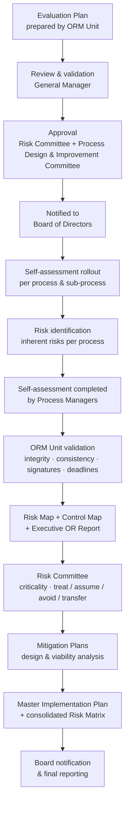
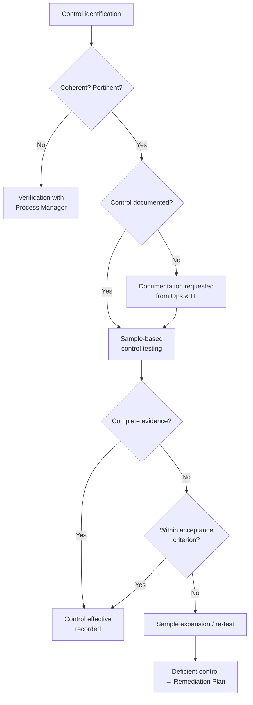
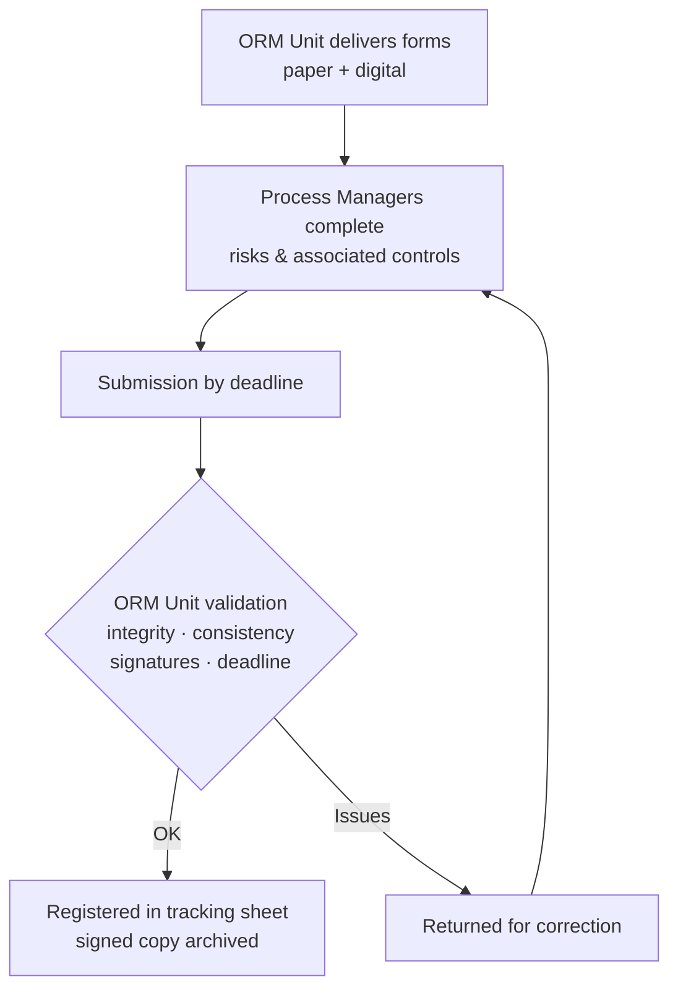
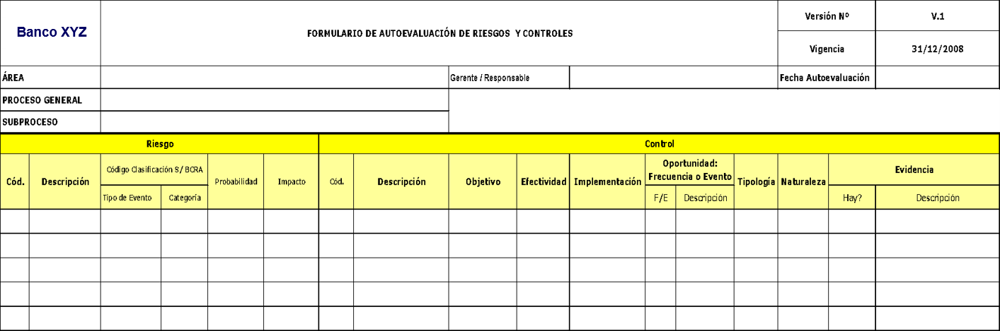
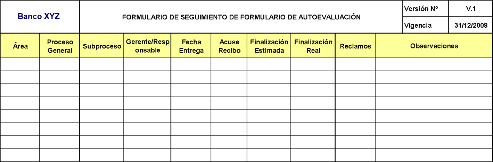
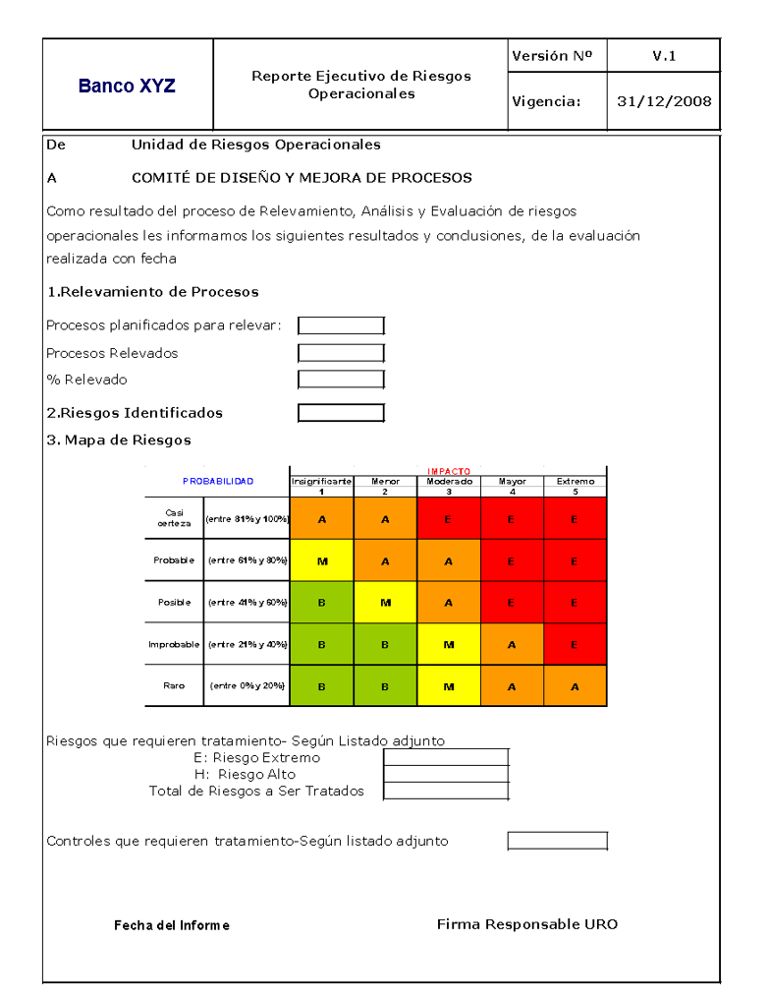
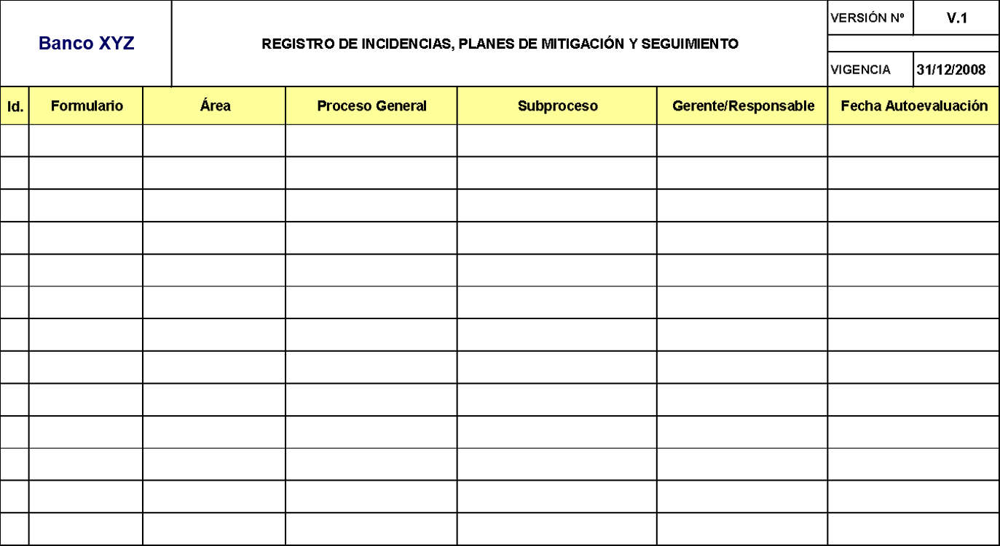
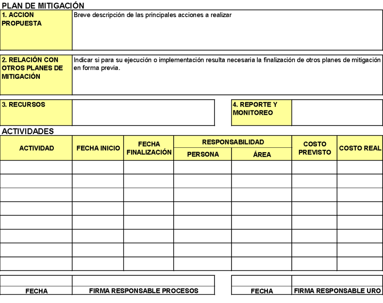
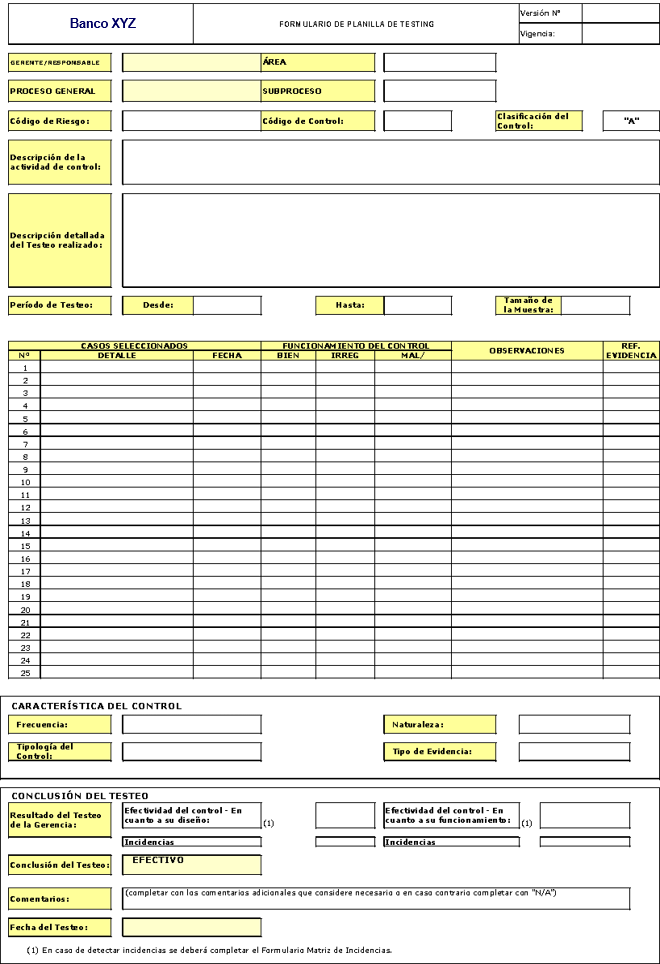

# Operational Risk Management System (ORMS) — Design & Multi-Client Rollout

> Methodological design of an Operational Risk Management System (SGRO) for financial institutions
> in response to the BCRA's operational risk guidelines (Com. A 4793, in force since April 2008),
> implemented across **10+ financial institutions and 1 insurance company**.

---

## 1. Overview / Executive Summary

When the Argentine central bank (BCRA) issued its first operational risk management guidelines
(Com. A 4793, April 2008), financial institutions faced a new regulatory requirement with no
proven local implementation model. I designed the SGRO methodology from scratch at BDO —
policies, processes, document framework and tools — and led its end-to-end rollout as project
coordinator and client-facing responsible, replicating the framework across **10+ financial
institutions** and later adapting it for an **insurance company**. Each implementation averaged
**1 year**. The methodology became the service line that **tripled the operating capacity of
BDO's Banking Consulting Unit** and opened new market segments (including automotive credit
companies).

🇵🇹🇪🇸 Resumo (PT) · Resumen (ES)

 

**🇵🇹** Quando o Banco Central da Argentina (BCRA) emitiu as diretrizes de gestão de risco operacional
(Com. A 4793, vigente desde abril de 2008), as instituições financeiras enfrentaram um novo requisito
regulatório sem modelo de implementação comprovado no mercado. Projetei a metodologia do SGRO na BDO e
liderei sua implantação de ponta a ponta como coordenador de projetos e responsável perante os clientes,
replicando-a em **mais de 10 instituições financeiras** e posteriormente em **uma seguradora**. Cada
implementação teve em média 1 ano. A metodologia **triplicou a capacidade operativa da Unidade de
Consultoria Bancária da BDO**.

**🇪🇸** Cuando el Banco Central argentino (BCRA) emitió los lineamientos de gestión del riesgo operacional
(Com. A 4793, vigente desde abril de 2008), las entidades financieras enfrentaron un nuevo requisito
regulatorio sin modelo de implementación probado en el mercado. Diseñé la metodología del SGRO en BDO y
lideré su implementación de punta a punta como coordinador de proyectos y responsable ante clientes,
replicándola en **más de 10 entidades financieras** y posteriormente en **una compañía de seguros**.
Cada implementación tuvo en promedio 1 año. La metodología **triplicó la capacidad operativa de la
Unidad de Consultoría Bancaria de BDO**.

---

## 2. Context & Challenge

- **Regulatory trigger**: BCRA Com. A 4793 (April 2008) — first Argentine regulatory framework
  mandating operational risk management systems in financial institutions
- **Market gap**: entities needed to build policy, processes, self-assessment and reporting
  structures from zero, with no local precedent or off-the-shelf methodology
- **Business challenge for BDO**: convert a new regulation into a replicable consulting service,
  not a one-off project

🇵🇹🇪🇸 Contexto e Desafio (PT) · Contexto y Desafío (ES)

 

**🇵🇹** Gatilho regulatório: Com. A 4793 do BCRA (abril de 2008) — primeiro marco regulatório argentino
que exige sistemas de gestão de risco operacional nas instituições financeiras · Lacuna de mercado: as
entidades precisavam construir política, processos, autoavaliação e estrutura de reportes do zero, sem
precedente local ou metodologia pronta · Desafio de negócio para a BDO: converter uma nova regulamentação
em um serviço de consultoria replicável, não em um projeto pontual

**🇪🇸** Disparador regulatorio: Com. A 4793 del BCRA (abril de 2008) — primer marco regulatorio argentino
que exige sistemas de gestión del riesgo operacional en las entidades financieras · Vacante de mercado:
las entidades necesitaban construir política, procesos, autoevaluación y estructura de reportes desde
cero, sin precedente local ni metodología lista · Desafío de negocio para BDO: convertir una nueva
regulación en un servicio de consultoría replicable, no en un proyecto puntual

## 3. My Role

- **Senior Consultant · Project Coordinator · PMO** — full client-facing responsibility across
  **2008–2012** (avg. 1 year per implementation)
- **End-to-end ownership**: lead generation → proposal → project kick-off → in-company training →
  progress reporting → final results presentation
- **Board-level exposure**: co-presented trainings, kick-offs and final reports before the
  **Board of Directors and executive authorities of each entity** (introduction by the engagement
  partner; full technical exposition delivered by me)
- **Team**: coordinated the project team of myself, **3 senior consultants, 1 semi-senior and
  2 juniors** (working multiple parallel engagements)

🇵🇹🇪🇸 Meu Papel (PT) · Mi Rol (ES)

 

**🇵🇹** Consultor Sênior · Coordenador de Projetos · PMO — responsabilidade de ponta a ponta perante os
clientes (2008–2012, média de 1 ano por implementação) · Domínio ponta a ponta: geração de leads →
proposta → kick-off → capacitação in-company → relatórios de avanço → apresentação final de resultados ·
Exposição a nível de diretoria: co-apresentação de capacitações, kick-offs e relatórios finais perante o
Conselho de Administração e autoridades executivas de cada entidade (introdução pelo sócio responsável;
exposição técnica completa ministrada por mim) · Equipe: coordenação de 3 consultores sêniores,
1 semi-sênior e 2 juniors em múltiplos projetos paralelos

**🇪🇸** Consultor Sénior · Coordinador de Proyectos · PMO — responsabilidad de punta a punta ante los
clientes (2008–2012, promedio de 1 año por implementación) · Dominio de extremo a extremo: generación
de leads → propuesta → kick-off → capacitación in-company → informes de avance → presentación final de
resultados · Exposición a nivel de directorio: co-presentación de capacitaciones, kick-offs e informes
finales ante el Directorio y autoridades ejecutivas de cada entidad (introducción del socio responsable;
exposición técnica completa a mi cargo) · Equipo: coordinación de 3 consultores séniores, 1 semi-sénior
y 2 juniors en múltiples proyectos en paralelo

## 4. Approach & Methodology

The framework was built once and replicated per client in **3 sequential stages**:

**Stage 1 — Framework Design**
- Operational Risk Policy design + SGRO Operating Manual
- Diagnosis for implementation; Master Plan per sub-process area with owners
- Process & sub-process mapping
- In-company training program on policy and procedures

**Stage 2 — Operationalization**
- SGRO Procedure Manual · design of forms, reports and registers
- Self-assessment forms per process and sub-process
- Risk identification per process/sub-process with **associated controls mapped**
- KPI/KRI indicator standards defined (delivered at project close)
- Progress reports to client leadership

**Stage 3 — Consolidation & Closure**
- Consolidated risk map (process and entity level)
- **Mitigation plans designed and registered in the SGRO for extreme risks**
- Final report + results presentation before Board/executive authorities

🇵🇹🇪🇸 As 3 Etapas (PT) · Las 3 Etapas (ES)

 

**🇵🇹** Etapa 1: Projeto da Política de Risco Operacional + Manual Operacional do SGRO, diagnóstico,
Plano Diretor por área e mapa de processos + capacitação in-company · Etapa 2: Manual de Procedimentos,
formulários de autoavaliação, identificação de riscos com controles associados, padrões de indicadores
KPI/KRI e relatórios de avanço · Etapa 3: Mapa de riscos consolidado, planos de mitigação para riscos
extremos registrados no SGRO, relatório final e apresentação de resultados

**🇪🇸** Etapa 1: Diseño de la Política de Riesgo Operacional + Manual Operativo del SGRO, diagnóstico,
Plan Maestro por área y mapa de procesos + capacitación in-company · Etapa 2: Manual de Procedimientos,
formularios de autoevaluación, identificación de riesgos con controles asociados, estándares de
indicadores KPI/KRI e informes de avance · Etapa 3: Mapa de riesgos consolidado, planes de mitigación
para riesgos extremos registrados en el SGRO, informe final y presentación de resultados

---

## 5. Key Deliverables

**Framework (one-time design)**
- Operational Risk Policy & SGRO Operating Manual
- Process/sub-process mapping model · Forms, reports & registers design · KPI/KRI standards

**Per entity (10+ implementations)**
- Diagnosis & Master Implementation Plan per sub-process area
- Self-assessment forms by process and sub-process
- **300–400 operational risks identified, assessed and controlled per entity (average)** — the
  most complex entities **exceeded 800** — with associated controls mapped and mitigation plans
  designed & registered for extreme risks
- Consolidated risk map · Progress reports & final results presentation
- In-company training program (policy, procedures and system use)

🇵🇹🇪🇸 Entregáveis (PT) · Entregables (ES)

 

**🇵🇹** Estrutura (design único): Política de Risco Operacional, Manual Operacional SGRO, modelo de
mapas de processos, formularios/registros e padrões KPI/KRI · Por entidade: diagnóstico e Plano Diretor,
formulários de autoavaliação, **300–400 riscos operacionais identificados, avaliados e controlados por
entidade (média)** — as mais complexas **superaram 800** — com controles associados e planos de
mitigação registrados para riscos extremos, mapa de riscos consolidado, relatórios de avanço e relatório
final, programa de capacitação in-company

**🇪🇸** Marco (diseño único): Política de Riesgo Operacional, Manual Operativo SGRO, modelo de mapas de
procesos, formularios/registros y estándares KPI/KRI · Por entidad: diagnóstico y Plan Maestro,
formularios de autoevaluación, **300–400 riesgos operativos identificados, evaluados y controlados por
entidad (promedio)** — las más complejas **superaron los 800** — con controles asociados y planes de
mitigación registrados para riesgos extremos, mapa de riesgos consolidado, informes de avance e informe
final, programa de capacitación in-company

## 6. Results & Impact

- 🔁 **10+ financial institutions** implemented the framework + **1 insurance company** after
  methodological adaptation
- ⚙️ **300–400 operational risks identified, assessed and controlled per entity (average)** —
  complex entities exceeded **800** — full cycle: identification → controls mapping →
  mitigation plans for extreme risks
- 📈 **+300% operating capacity** of BDO's **Banking Consulting Unit** — the methodology
  sustained the execution of complex and strategic projects
- 🚪 **New market entry**: opened client segments previously unreachable — nearly all Argentine
  automotive credit companies implemented this methodology (excepting one)

## 7. Methodology & Process Architecture

The SGRO was structured around a documented procedure library (10 formal procedures) governed
by four roles: **ORM Unit (URO)**, **Process Managers**, **General Management** and the
**Risk Committee**, with the **Process Design & Improvement Committee** at board level —
notified at every governance gate.

### Master Cycle

### Control Testing Decision Flow

### Self-Assessment Loop

### Documented Procedure Library (10 procedures)

1. Evaluation Plan preparation, approval & Board notification
2. Self-assessment planning (process scoping, inherent risk registration)
3. Self-assessment distribution & delivery control
4. Self-assessment completion, return & validation
5. Post-assessment analysis & executive reporting
6. Control analysis (coherence · pertinence · documentation)
7. Mitigation Plans development (needs register & joint workshops)
8. Individual plan viability review with General Management
9. Portfolio-level plan analysis & Master Implementation Plan
10. Control testing (sampling, work papers, effectiveness evaluation)

> 📄 The complete in-company training deck — regulatory framework, policy, procedures,
> forms, risk matrix (5×5), control matrix and implementation scheme — is available in
> [`docs/sgro-in-company-training.pdf`](docs/sgro-in-company-training.pdf).

---

## 8. Deliverable Evidence

Operational tools actually deployed across implementations (full views in `assets/`):

| # | Evidence | File |
|---|----------|------|
| 01 | Risk & Control Self-Assessment Form | `assets/01-self-assessment-form.png` |
| 02 | Self-Assessment Tracking Form | `assets/02-self-assessment-tracking-form.png` |
| 03 | Executive Operational Risk Report | `assets/03-executive-risk-report.png` |
| 04 | Incidents, Mitigation Plans & Follow-up Register | `assets/04-incident-mitigation-register.png` |
| 05 | Mitigation Plan | `assets/05-mitigation-plan-form.png` |
| 06 | Control Testing Worksheet | `assets/06-control-testing-worksheet.png` |

🖼️ View evidence gallery

 

## 9. Tools & Frameworks

Basel III · BCRA Com. A 4793 · ISO 31000 approach · Process mapping (BPMN structure) ·
Self-assessment methodology · KPI/KRI design · In-company training development

## 10. Business Development & Thought Leadership

Beyond delivery, this project positioned me as a market-builder for the practice:

- 🥐 **Lead generation program**: organized executive breakfasts for financial institutions,
  presenting the SGRO methodological framework as the sales entry point
- 🎤 **Invited speaker**: presentations at **Segurinfo (Argentina)** and as guest at a
  **BCRA risk committee** session
- 🧑‍💼 **Community builder**: founder & administrator of LinkedIn group
  **LATAM GRC: Gobierno | Riesgo | Compliance** — ~3,000 members
  ([linkedin.com/groups/2958635](https://www.linkedin.com/groups/2958635/))
- ⭐ Multiple client recommendations on [my LinkedIn profile](https://www.linkedin.com/in/ffruchtenicht)

## 11. What I Learned

- Designing once and replicating ten times beats customizing ten times — methodology assets
  compound, projects don't
- Regulatory deadlines create demand windows: the first mover with a working framework sells
  without competing on price
- Board-level communication required a different craft than technical delivery — the final
  presentation skill was developed across 10+ boardrooms

---

📧 Contact: [LinkedIn](https://www.linkedin.com/in/ffruchtenicht) · ffruchtenicht@gmail.com
