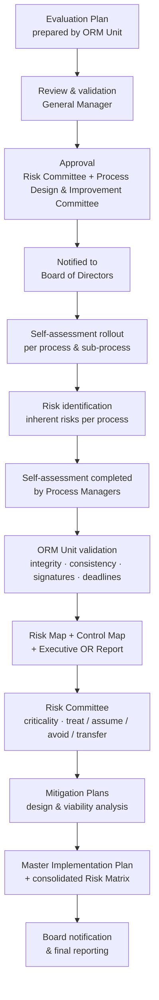
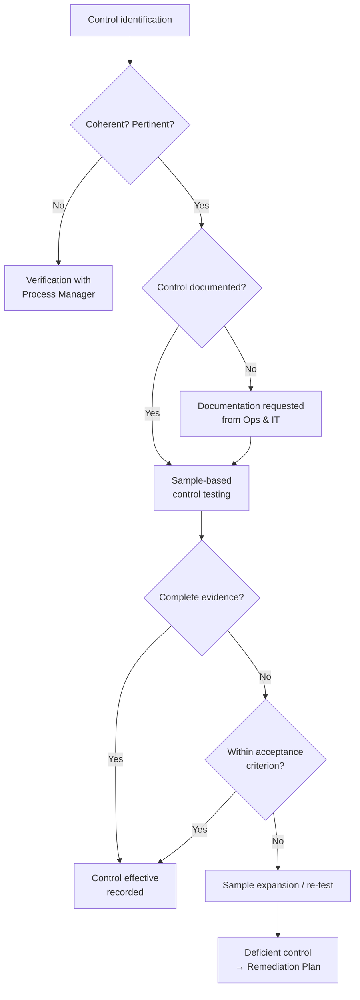
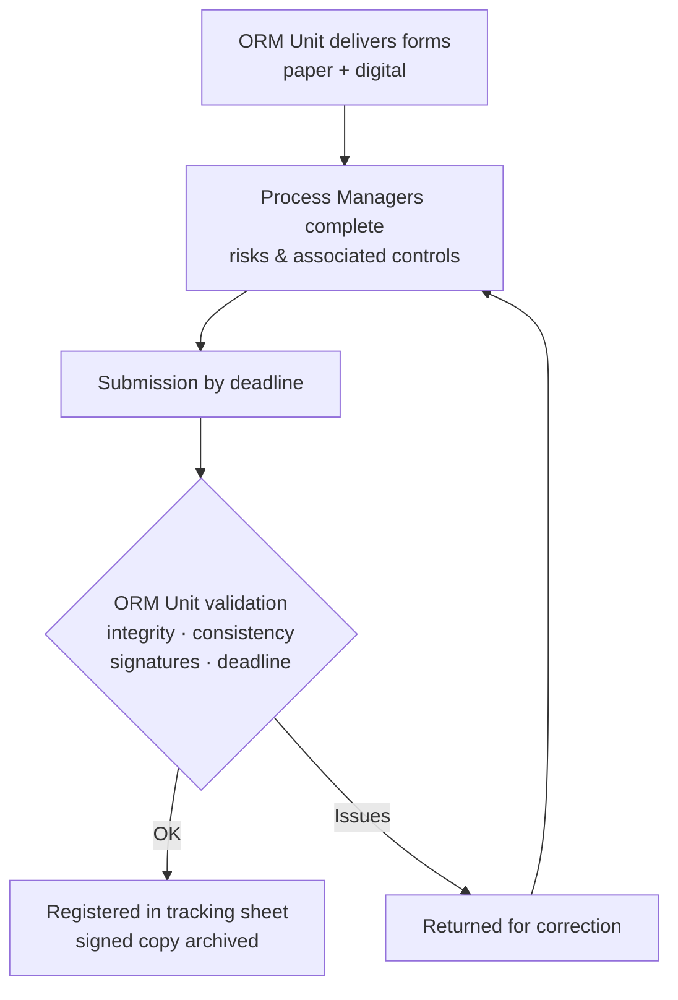
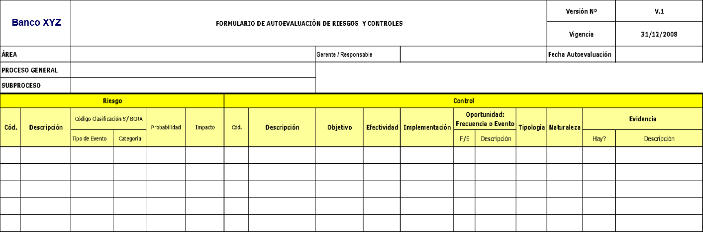
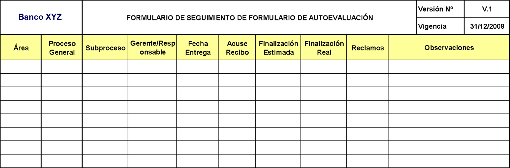
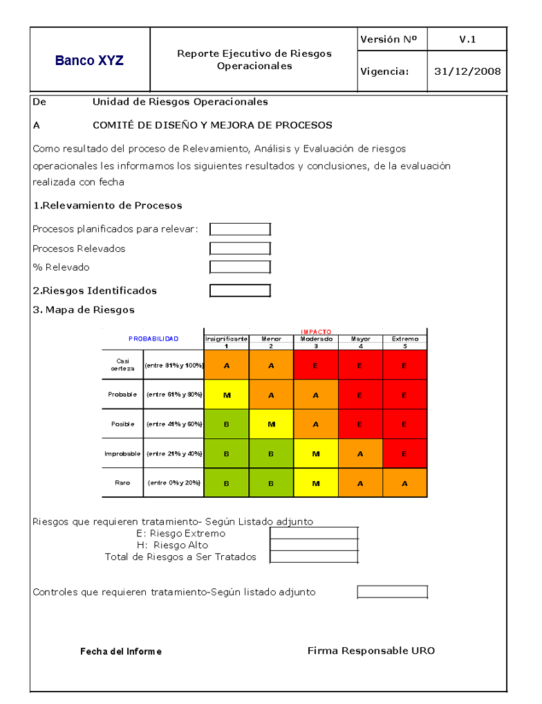
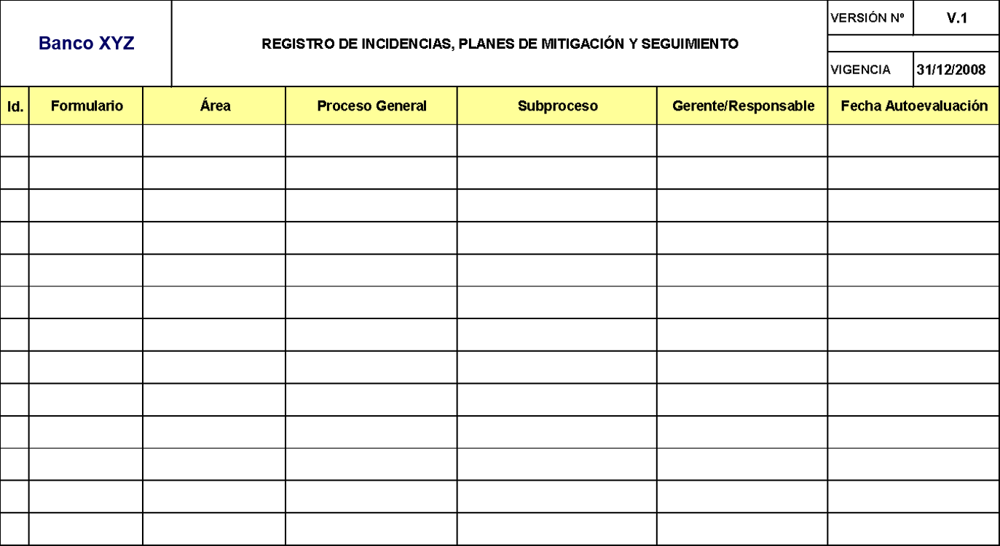
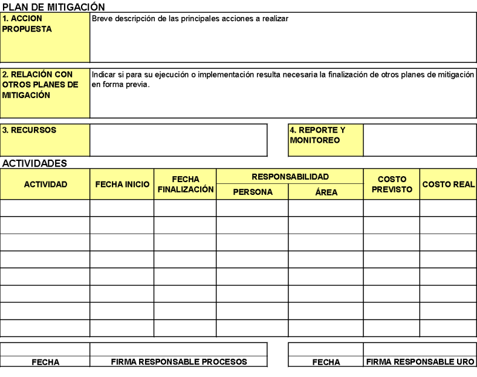
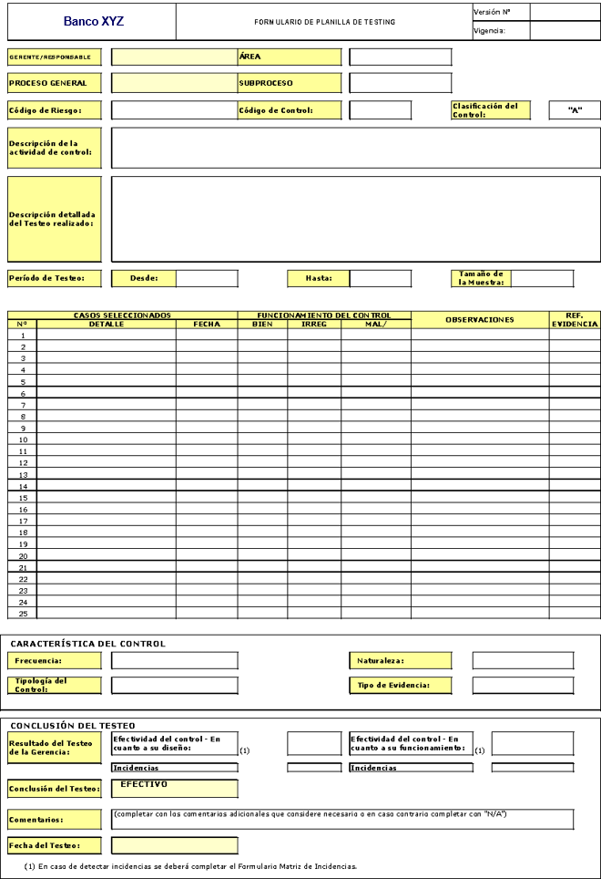

# Operational Risk Management System (ORMS / SGRO) — Enterprise Multi-Client Rollout
### Senior Project Manager — Risk & Banking Advisory (PMBOK) | BDO Argentina

[-2ea44f?style=for-the-badge)](https://www.linkedin.com/in/ffruchtenicht)

---

| Metadata Field | Project Profile Details |
| :--- | :--- |
| **Official Title** | Enterprise Design & Multi-Entity Rollout of the Operational Risk Management System (SGRO) |
| **Role & Ownership** | **Senior Project Manager — Risk & Banking Advisory** (Full PMBOK Governance & Engagement Lead) |
| **Consulting Firm** | **BDO Argentina** (Financial Services & Advisory Practice) |
| **Timeline & Duration** | **July 2008 – June 2012** (4 Years · Avg. 12 months per client implementation cycle) |
| **Regulatory Drivers** | BCRA Communication "A" 4793 · Basel II/III Framework · Sarbanes-Oxley (SOX) §404 |
| **Team Managed** | 7 Cross-Functional Consultants (3 Senior Consultants, 1 Semi-Senior, 2 Juniors + Engagement Lead) |
| **Executive Stakeholders** | Board of Directors, Executive Steering Committees, Risk Committees (CRO), General Management |

---

## 1. Executive Summary & Delivery Scope

When the Central Bank of Argentina (BCRA) enforced its pioneer operational risk mandate (**Communication "A" 4793**, April 2008 / Basel II/III), domestic and international financial entities faced strict statutory compliance deadlines without proven local operating models.

As **Senior Project Manager** at BDO Argentina, I held end-to-end delivery ownership for architecting the proprietary **Operational Risk Management System (SGRO)** from the ground up, directing its multi-client rollout across **10+ commercial banks, automotive credit financial institutions, and 1 major insurance group**. 

Operating under the **PMBOK framework**, I governed the entire project lifecycle—from commercial Statements of Work (SOW) and cost baselines to work breakdown structures (WBS), risk registers, quality assurance (QA), and Board-level sign-offs. The methodology transformed a one-off regulatory obligation into BDO's premier banking advisory practice, **tripling (+300%) the practice's operational delivery capacity**.

---

## 2. Business Challenge & Strategic Context

* **Regulatory Urgency:** BCRA Com. "A" 4793 required financial institutions to establish auditable policies, risk identification registers, Key Risk Indicators (KRIs), and loss event reporting with severe penalties for non-compliance.
* **Absence of Proven Local Models:** Commercial banks lacked standardized frameworks, workflows, and self-assessment tooling tailored to local core banking operations.
* **Practice Scalability Challenge (BDO):** Converting a complex, high-friction regulatory requirement into a modular, repeatable consulting service line capable of running concurrent engagements without quality degradation.

---

## 3. Senior PM Leadership & Delivery Governance

As the **Senior Project Manager & Client-Facing Engagement Lead**, I exercised full managerial and fiduciary governance across all client rollouts:

* **PMBOK Lifecycle Governance:** Established scope baselines, Statements of Work (SOW), critical path schedules (CPM), resource allocation, milestone tracking, and deliverable Quality Assurance (QA).
* **Multi-Project Portfolio Leadership:** Governed up to 4 concurrent bank implementations, leading a dedicated delivery squad of **7 consultants** (3 Seniors, 1 Semi-Senior, 2 Juniors).
* **C-Suite & Board-Level Stakeholder Management:** Co-chaired steering committees and delivered technical presentations directly to the **Board of Directors, Chief Risk Officers (CRO), and Audit Committees** of each institution.
* **Commercial & P&L Alignment:** Led client kick-offs, pre-sales technical proposals, executive change control boards, and final acceptance closures (sign-off).

---

## 4. Methodological Framework & Stage-Gate Rollout

Each 12-month client implementation was executed across 3 structured, stage-gated delivery phases:

### Phase 1 — Diagnostic & Framework Architecture (Months 1–3)
* **Institutional Baseline:** Enterprise diagnostic across core banking units (Trading Desk, Commercial Lending, Cards, Treasury, IT Operations).
* **Policy & Chartering:** Formulation of the formal Operational Risk Policy and SGRO Operating Manual.
* **Process Decomposition (BPMN):** Detailed workflow mapping of critical banking processes and sub-processes with designated Business Process Owners (BPOs).
* **Executive Enablement:** In-company change management workshops and governance training for senior leadership.

### Phase 2 — System Operationalization & Risk Mapping (Months 4–8)
* **Procedure Library:** Deployment of 10 formal operational risk procedures, audit trails, and reporting forms.
* **Control Mapping & Self-Assessments:** Execution of qualitative and quantitative risk self-assessments per department.
* **Risk & Control Identification:** Identification and cataloging of **300 to 800+ operational risks per entity**, mapping associated preventive/detective controls and control deficiencies.
* **Metric Engineering:** Design and baseline establishment for **Key Risk Indicators (KRIs)**, Loss Event Databases, and tolerance thresholds.

### Phase 3 — Risk Consolidation, Governance Gates & Board Sign-off (Months 9–12)
* **Heatmap & Risk Matrix:** Construction of entity-wide dynamic Risk Heatmaps and executive dashboards.
* **Mitigation Roadmaps:** Formulation of formal Remediation & Corrective Action Plans for residual and extreme risks.
* **Steering Committee Handoff:** Final delivery and formal defense of the SGRO deployment before the **Board of Directors and Risk Committee**.

---

## 5. Verified Deliverables & Work Products

| Deliverable Domain | Work Product Delivered | Target Stakeholder |
| :--- | :--- | :--- |
| **Governance Framework** | Enterprise Operational Risk Policy & SGRO Master Governance Manual | Board of Directors / BCRA |
| **Process Models** | Complete BPMN workflow models standardizing all business processes | Process Owners / Operations |
| **Risk Architecture** | Comprehensive Risk Catalog (300–800+ operational risks & controls mapped per bank) | Chief Risk Officer (CRO) |
| **Metrics & Early Warning** | Key Risk Indicator (KRI) dashboards & Operational Loss Event Database | Risk Committee / Internal Audit |
| **Remediation Plans** | Corrective Action Plans & mitigation roadmaps for high-impact/extreme risks | Executive Committee / C-Suite |
| **Audit Trails & Evidence** | Stage-gate compliance documentation, training registries, and formal Board sign-off reports | External Auditors / Central Bank |

---

## 6. Quantifiable Business Impact & Practice ROI

* **100% Regulatory Compliance Rate:** Successfully deployed and certified across **10+ commercial financial institutions and 1 tier-1 insurance company**, achieving zero central bank regulatory sanctions.
* **+300% Operating Practice Expansion:** Scaled BDO's Banking & Risk Consulting Unit delivery capacity by 3x, turning the SGRO methodology into the firm's most profitable financial service line.
* **Market Monopolization in Niche Lending:** Secured and executed implementations across nearly all Argentine automotive credit finance companies (captive auto lenders).
* **Deep Risk Mitigation at Scale:** Over **6,000+ total operational and IT risk scenarios** formally identified, assessed, controlled, and remediated across the financial system.
* **Post-Project Longevity:** The operating manuals and KRI indicator frameworks remained the baseline standard of the institutions for over a decade.

---

## 7. Operating Procedure Library & Governance Hierarchy

The deployed SGRO operates through a documented hierarchy of 10 institutional procedures governed across 4 distinct lines of defense:

1. **Process Managers (First Line of Defense):** Ongoing risk identification and control validation in daily core operations.
2. **Operational Risk Management Unit (URO) / Second Line:** Independent aggregation, KRI tracking, methodology maintenance, and stress testing.
3. **Internal Audit (Third Line):** Independent testing and assurance of methodology effectiveness and control compliance.
4. **Board-Level Risk Committee & General Management:** Final authority for risk tolerance limits, capital allocation, and mitigation plan approvals.

### Master Cycle

```mermaid
flowchart TD
    A[Evaluation Plan<br>prepared by ORM Unit] --> B[Review & validation<br>General Manager]
    B --> C[Approval<br>Risk Committee + Process Design & Improvement Committee]
    C --> D[Notified to<br>Board of Directors]
    D --> E[Self-assessment rollout<br>per process & sub-process]
    E --> F[Risk identification<br>inherent risks per process]
    F --> G[Self-assessment completed<br>by Process Managers]
    G --> H[ORM Unit validation<br>integrity · consistency · signatures · deadlines]
    H --> I[Risk Map + Control Map<br>+ Executive OR Report]
    I --> J[Risk Committee<br>criticality · treat / assume / avoid / transfer]
    J --> K[Mitigation Plans<br>design & viability analysis]
    K --> L[Master Implementation Plan<br>+ consolidated Risk Matrix]
    L --> M[Board notification<br>& final reporting]
```

### Control Testing Decision Flow

```mermaid
flowchart TD
    A[Control identification] --> B{Coherent? Pertinent?}
    B -- No --> C[Verification with<br>Process Manager]
    B -- Yes --> D{Control documented?}
    D -- No --> E[Documentation requested<br>from Ops & IT]
    D -- Yes --> F[Sample-based<br>control testing]
    E --> F
    F --> G{Complete evidence?}
    G -- Yes --> H[Control effective<br>recorded]
    G -- No --> I{Within acceptance<br>criterion?}
    I -- Yes --> H
    I -- No --> J[Sample expansion / re-test]
    J --> K[Deficient control<br>→ Remediation Plan]
```

### Self-Assessment Loop

```mermaid
flowchart TD
    A[ORM Unit delivers forms<br>paper + digital] --> B[Process Managers complete<br>risks & associated controls]
    B --> C[Submission by deadline]
    C --> D{ORM Unit validation<br>integrity · consistency<br>signatures · deadline}
    D -- OK --> E[Registered in tracking sheet<br>signed copy archived]
    D -- Issues --> F[Returned for correction]
    F --> B
```

### Documented Procedure Library (10 procedures)

1. Evaluation Plan preparation, approval & Board notification
2. Self-assessment planning (process scoping, inherent risk registration)
3. Self-assessment distribution & delivery control
4. Self-assessment completion, return & validation
5. Post-assessment analysis & executive reporting
6. Control analysis (coherence · pertinence · documentation)
7. Mitigation Plans development (needs register & joint workshops)
8. Individual plan viability review with General Management
9. Portfolio-level plan analysis & Master Implementation Plan
10. Control testing (sampling, work papers, effectiveness evaluation)

> 📄 The complete in-company training deck — regulatory framework, policy, procedures,
> forms, risk matrix (5×5), control matrix and implementation scheme — is available in
> [`docs/sgro-in-company-training.pdf`](docs/sgro-in-company-training.pdf).

---

## 8. Deliverable Evidence

Operational tools actually deployed across implementations (full views in `assets/`):

| # | Evidence | File |
|---|----------|------|
| 01 | Risk & Control Self-Assessment Form | `assets/01-self-assessment-form.png` |
| 02 | Self-Assessment Tracking Form | `assets/02-self-assessment-tracking-form.png` |
| 03 | Executive Operational Risk Report | `assets/03-executive-risk-report.png` |
| 04 | Incidents, Mitigation Plans & Follow-up Register | `assets/04-incident-mitigation-register.png` |
| 05 | Mitigation Plan | `assets/05-mitigation-plan-form.png` |
| 06 | Control Testing Worksheet | `assets/06-control-testing-worksheet.png` |

🖼️ View evidence gallery

 

## 9. Tools & Frameworks

Basel III · BCRA Com. A 4793 · ISO 31000 approach · Process mapping (BPMN structure) ·
Self-assessment methodology · KPI/KRI design · In-company training development

## 10. Business Development & Thought Leadership

Beyond delivery, this project positioned me as a market-builder for the practice:

- 🥐 **Lead generation program**: organized executive breakfasts for financial institutions,
  presenting the SGRO methodological framework as the sales entry point
- 🎤 **Invited speaker**: presentations at **Segurinfo (Argentina)** and as guest at a
  **BCRA risk committee** session
- 🧑‍💼 **Community builder**: founder & administrator of LinkedIn group
  **LATAM GRC: Gobierno | Riesgo | Compliance** — ~3,000 members
  ([linkedin.com/groups/2958635](https://www.linkedin.com/groups/2958635/))
- ⭐ Multiple client recommendations on [my LinkedIn profile](https://www.linkedin.com/in/ffruchtenicht)

## 11. What I Learned

- Designing once and replicating ten times beats customizing ten times — methodology assets
  compound, projects don't
- Regulatory deadlines create demand windows: the first mover with a working framework sells
  without competing on price
- Board-level communication required a different craft than technical delivery — the final
  presentation skill was developed across 10+ boardrooms

---

**Case Study Author:** Fernando R. Früchtenicht · Senior IT Project Manager  
[💼 Connect on LinkedIn](https://www.linkedin.com/in/ffruchtenicht) • [📩 Contact via Email](mailto:ffruchtenicht@gmail.com)

